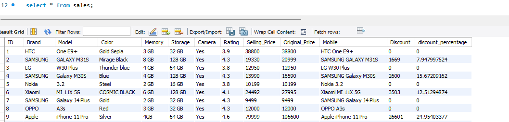

# Smartphone_Sales_SQL_Analysis

## 📌 Project Overview:
- This project analyzes smartphone sales data to uncover insights on pricing, discounts, and consumer preferences using SQL.
- Dataset is obtained from this link: https://www.kaggle.com/datasets/yaminh/smartphone-sale-dataset/data
- Columns in this dataset:
  `Brand`, `Model`, `Color`, `Memory`, `Storage`, `Camera`, `Mobile`, `Rating`, `Selling_Price`, `Original_Price`, `Discount`, `discount_percentage`
- Skills used: SQL, data analysis, business insights

### 📸 Dataset Preview
Here’s a snapshot of the dataset used in this project:

## 📊 Key Insights:
- Apple dominates the premium segment with the highest average selling price.
- Samsung covers all price categories, offering the widest product portfolio.
- Camera presence drives higher prices, showing its importance in buyer decisions.

## SQL concepts used in this analysis:
- Aggregations (SUM, AVG, COUNT)
- Filtering & categorization (CASE, WHERE)
- Subqueries (phones above avg price, brand avg rating)
- Window functions (RANK() OVER (PARTITION BY ...))
- CTEs (WITH clause)

## 🔍 Business Questions Answered:

A. Basic Analysis
1. How many brands, models, and total phones exist?
2. How many phones per brand?
3. What is the average selling price per brand?
4. What are the Top 10 most expensive phone models?

B. Discount Analysis
1. Which brand gives the highest average discount %?
2. Which models have the highest discount %?
3. How many phones were sold with vs without discounts?

C. Rating Analysis
1. What is the average rating per brand?
2. Which 10 models have the highest ratings?
3. Which 10 models have the lowest ratings?

D. Feature-Based Analysis

1. How many phones have ≥ 8GB RAM and 128GB storage?
2. What is the average price by storage type?
3. Do phones with cameras cost more than those without?

E. Advanced Analysis

1. Which brands offer the highest average discount?
2. What is the relationship between brand, avg price & avg rating?
3. Which are the Top 3 revenue-contributing models per brand? (Window Function)
4. Do higher discounts mean lower ratings?
5. What are the price categories of phones?
6. Which is the highest-rated phone in each brand?
7. Which phones are priced above average selling price?
8. How does a phone’s rating compare to its brand average?

## 📂 Project Structure
- `README.md` → documentation  
- `basic_analysis.sql` → descriptive queries  
- `discount_analysis.sql` → discount-related queries  
- `rating_analysis.sql` → ratings & reviews  
- `feature_insights.sql` → memory, storage, camera insights  
- `advanced_analysis.sql` → KPIs & deeper insights
